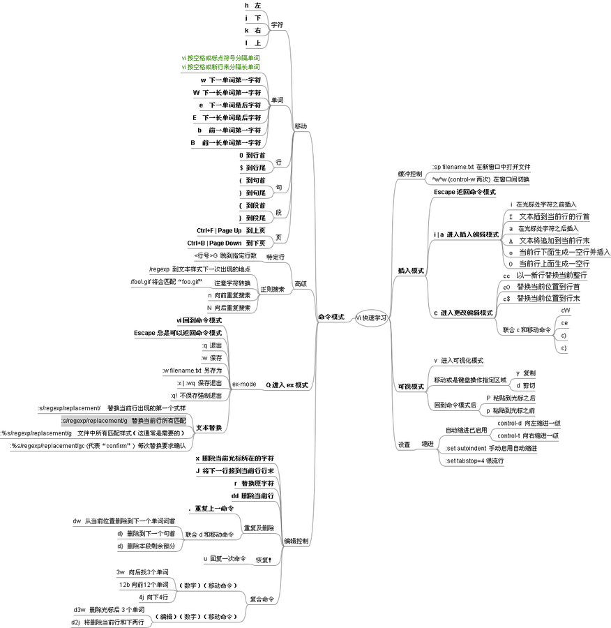

# Python-Tips


## 1.python2 和 python3 共享

```Shell
conda create --name py27 python=2.7 anaconda
conda create --name py35 python=3.5 anaconda
```
切换环境
```Shell
activate <env name> (Windows)
source activate <env name> (Linux)
```

## 2. pickle from python2 to python3

```Error
  File "H:\fixers - 3.4\addressfixer - 3.4\trunk\lib\address\address_generic.py"
, line 382, in read_ref_files
    d = pickle.load(open(mshelffile, 'rb'))
UnicodeDecodeError: 'ascii' codec can't decode byte 0xe2 in position 1: ordinal
not in range(128)
```
Solve Solution
```Python
with open(mshelffile, 'rb') as f:
    d = pickle.load(f, encoding='latin1') 
```

## 3. download file from Internet in Python

```python
import urllib.request, urllib.parse, urllib.error

origin = 'https://raw.githubusercontent.com/brmson/dataset-sts/master/data/para/msr/msr-para-train.tsv'
dataset = 'msr-para-train.tsv'
print('Downloading data from %s' % origin)
urllib.request.urlretrieve(origin, dataset)
```


## 4. pyCharm (2016.1) 添加 python 路径


## 5. Add Python Path In Linux
1. http://stackoverflow.com/questions/3402168/permanently-add-a-directory-to-pythonpath
2. 
```
vi ~/.bashrc
export PYTHONPATH=${PYTHONPATH}:path1:path2
```

## 6. Git Operation
```git
git init
git add README.md
git commit -m "first commit"
git remote add origin https://github.com/rgtjf/test.git
git push -u origin master
```

## 7. Python Deployment and Subversion Configuration
### 1. Python Deployment: 映射到服务器, 可以上传, 下载

### 2. Share Project to Subversion: 映射到Subversion, 代码管理

### 3. How to setup Subversion in Ubuntu
http://www.krizna.com/ubuntu/setup-svn-server-on-ubuntu-14-04/

## 8.tmux
### 进入tmux
- 输入tmux 进入

### 分屏操作
- 分屏
  - Ctrl+b, ”：（先同时按住Ctrl和b, 然后按住”） 将当前面板平分为上下两块
  - Ctrl+b, %： 将当前面板平分为左右两块
- 去掉屏
  - Ctrl+b, x： 退出当前分出的一块小屏
  - Ctrl+b, &； 退出当前所有
  
### 退出tmux
- Ctrl+b, d: 退出并保留，下次可以重新进入

### 重新进入tmux
- tmux ls: 列出当前有哪些tmux窗口
- tmux attach -t 0: 重新连接第1个tmux窗口

### 其他
- Ctrl+b, PageUp: 在session中读取以前的页面，按~键退出
- Ctrl+b, 左右方向将：修改panel大小

## 9.jupyter-notebook
- Ref: http://jupyter-notebook.readthedocs.io/en/latest/public_server.html
- Prerequisite: A notebook configuration file
  create a notebook configuration file, ~/.jupyter/jupyter_notebook_config.py.
  
  If you don’t already have one, create a config file for the notebook using the following command:

  ```
  $ jupyter notebook --generate-config
  ```
- Running a public notebook server on shell(Ubuntu)

  ```
  $ jupyter notebook --no-browser
  ```
- Allow from other computer
  Setting ~/.jupyter/jupyter_notebook_config.py.

  ```
  # Set ip to '*' to bind on all interfaces (ips) for the public server
  c.NotebookApp.ip = '*'
  ```

## 10.solve GPU device not found on Ubuntu 14.04
- Error: 
  ```
  - CUDA_ERROR_NO_DEVICE
  - Couldn't open CUDA library libcudnn.so
  - No GPU devices available on machine.
  ```

- Solution:
  
  ```
  $ export CUDA_VISIBLE_DEVICES=0
  ```
  
  ```
  $ sudo ln -s /usr/lib/x86_64-linux-gnu/libcuda.so.1 /usr/lib/x86_64-linux-gnu/libcuda.so
  ```

## 11.PyCharm使用技巧

- `ctrl+alt+L`, 格式化代码
- `alt+enter`, 出错万能键，不同场景有不同的表现方式，在还没import(install)模块名上使用会import(install)相对应的模块，在方法名上使用补注释，在测试中使用帮你补充断言代码……
- `ctrl+space`, 万能提示键 `ctrl+space` 万能提示键，PyCharm的会根据上下文提供补全。不仅是代码提示，`ctrl+f`搜索的时候，不知道该键入啥时就按下，经常给人惊喜。在windows下由于输入法无法使用这个快捷键，`ctrl+alt+s`打开设置键入 keymap，在Keymap中搜索basic可以找到并修改它 (改为`shift+H`)
- 阅读代码快捷键
  - `ctrl+q`, 查注释 
  - `ctrl+shift+i`, 没注释时查源码 
  - `ctrl+p`, 调用方法时查看参数，在括号内按下，就知道当前位置该给啥参数，不过由于是Python，这里使用`ctrl+space`也可以达到很好的效果
- 变量或表达式的最后键入`.(点)`，出现提示后，看最下面的部分有各种代码模板，例如现有变量a，在下一行键入 a.(点)print 然后键入`tab`，Python2会变成`print a`，Python3会变成`print(a)`，还有if,else等各种常用的代码模板
- 双击`shift`搜索一切，不管是IDE功能、文件、方法、变量……都能搜索
- 写代码时快捷键
  - ctrl + / 快速注释
  - ctrl + d 复制光标所在的行
- 本机编辑，运行时使用了远程环境，省去了环境切换的麻烦。
- Reference: https://www.zhihu.com/question/37787004


## 12.Vim装逼指南

- [老司机乱谈编辑器之神——vim移动研发](http://bbs.utest.qq.com/524)

- [How to learn vim](https://github.com/dofy/learn-vim)

- 

- 

- 

- 